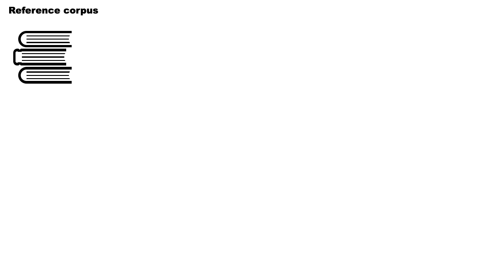
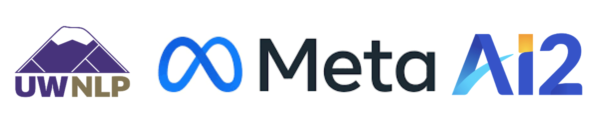

# Nonparametric Masked Language Modeling

This repo contains the original implementation of the paper "[Nonparametric Masked Language Modeling](https://arxiv.org/abs/2212.01349)".

<p align="center">
  
</p>

```
@article{ min2022nonparametric,
    title={ Nonparametric Masked Language Modeling },
    author={ Min, Sewon and Shi, Weijia and Lewis, Mike and Chen, Xilun and Yih, Wen-tau and Hajishirzi, Hannaneh and Zettlemoyer, Luke },
    year={ 2022 }
}
```

Currently, the repo contains the code for inference. Stay tuned for the code for training.

## Content

1. [Requirements](#requirements)
2. [Checkpoint and Data](#checkpoint-and-data)
3. [Closed-set Experiments](#closed-set-experiments)
    * [Baselines](#baselines-on-closed-set-tasks)
    * [NPM](#npm-on-closed-set-tasks)
    * [NPM Single](#npm-single-on-closed-set-tasks)
4. [Open-set Experiments](#open-set-experiments)
    * [Baselines](#baselines-on-open-set-tasks)
    * [NPM](#npm-on-open-set-tasks)
5. [License](#license)
6. [Contact](#contact)

## Requirements

```
conda create -n npm python=3.7
conda activate npm
pip3 install -r requirements.txt --user
```

If you will use open-set tasks, make sure to install java as well.
```bash
conda install -c conda-forge openjdk
```

Note that multi-gpu inference is not supported for now.

## Checkpoint and Data

Download the checkpoint via
```bash
# NPM checkpoint (phrase retrieval model)
mkdir -p save/npm && wget https://dl.fbaipublicfiles.com/NPM/npm.ckpt -O save/npm/model.ckpt

# NPM-single checkpoint (token retrieval model)
mkdir -p save/npm-single && wget https://dl.fbaipublicfiles.com/NPM/npm-single.ckpt -O save/npm-single/model.ckpt
```

Evaluation datasets and reference corpora can be downloaded via
```bash
# To run evaluation on closed-set tasks
bash scripts/download_data.sh closed
bash scripts/download_corpus.sh closed

# To run evaluation on open-set tasks
bash scripts/download_data.sh open
bash scripts/download_corpus.sh open

# To run evaluation on TempLAMA (need Wikipedia 2022)
bash scripts/download_data.sh templama
bash scripts/download_corpus.sh templama
```

The corpus data is required for NPM and the retrieve-and-generate baselines. If you will only run parametric baselines, you can skip downloading the corpus.

Note that all reference corpus files are saved under `corpus/` and evaluation datasets are saved under `data/`. Model-related files (checkpoints, dstore with embeddings, predictions) will be saved under `save/` directory.

## Closed-set Experiments

#### Baselines on closed-set tasks
The following is the script for runing the RoBERTA-large baseline on all 9 datasets used in the paper.
```bash
python -m scripts.prompt \
    --eval_dataset agn+yahoo+rte+subj+sst2+mr+rt+cr+amazon \
    --save_dir save/roberta \
    --single
```

#### NPM on closed-set tasks

```bash
# To run on AGN, Yahoo and RTE:
bash scripts/save_embeddings.sh save/npm enwiki-0 false 384
bash scripts/save_embeddings.sh save/npm cc_news false 384
python -m scripts.prompt \
    --corpus_data enwiki-0+cc_news \
    --checkpoint_path npm \
    --eval_dataset agn+yahoo+rte \
    --temperature 5.0 \
    --save_dir save/npm

# To run on Subj:
bash scripts/save_embeddings.sh save/npm subj false 384
python -m scripts.prompt \
    --corpus_data subj \
    --checkpoint_path npm \
    --eval_dataset subj \
    --temperature 5.0 \
    --save_dir save/npm

# To run on SST-2, MR, RT, CR and Amazon:
bash scripts/save_embeddings.sh save/npm imdb false 384
bash scripts/save_embeddings.sh save/npm amazon false 384
python -m scripts.prompt \
    --corpus_data imdb+amazon \
    --checkpoint_path npm \
    --eval_dataset sst2+mr+rt+cr+amazon \
    --temperature 5.0 \
    --save_dir save/npm
```

Note that `scripts/save_embeddings.sh` takes 'save directory', 'corpus name', 'whether it is an open-set task' and `batch size` (`384` is good for a 32gb GPU) as arguments.

#### NPM Single on closed-set tasks

```bash
# To run on AGN, Yahoo and RTE:
bash scripts/save_embeddings.sh save/npm-single enwiki-0 false 384
bash scripts/save_embeddings.sh save/npm-single cc_news false 384
python -m scripts.prompt \
    --corpus_data enwiki-0+cc_news \
    --checkpoint_path npm-single \
    --eval_dataset agn+yahoo+rte \
    --temperature 5.0 \
    --single \
    --save_dir save/npm-single


# To run on Subj:
bash scripts/save_embeddings.sh save/npm-single subj false 384
python -m scripts.prompt \
    --corpus_data subj \
    --checkpoint_path npm-single \
    --eval_dataset subj \
    --temperature 5.0 \
    --single \
    --save_dir save/npm-single

# To run on SST-2, MR, RT, CR and Amazon:
bash scripts/save_embeddings.sh save/npm-single imdb false 384
bash scripts/save_embeddings.sh save/npm-single amazon false 384
python -m scripts.prompt \
    --corpus_data imdb+amazon \
    --checkpoint_path npm-single \
    --eval_dataset sst2+mr+rt+cr+amazon \
    --temperature 5.0 \
    --single \
    --save_dir save/npm-single
```

## Open-set Experiments

#### Baselines on open-set tasks

Run the following to run causal language model baselines (T5 baselines are TBA!).

```bash
python -m scripts.clm_prompt \
    --eval_dataset {lama-trex|lama-google_re|kamel|triviaqa|nq|entity_translation} \
    --model_name {j-6b|neo-1.3b|neo-2.7b|neox-20b|opt-1.3b|opt-2.7b|opt-6.7b|opt-13b|opt-30b|bloom-1b7|bloom-3b|bloom-7b1} \
    --save_dir save/clms
```

By default, this does not use any passages from an external corpus. Specify `--ret bm25` if use BM25 passages from Wikipedia 2019, and `--ret bm25_2022` to use BM25 passages from Wikipedia 2022 (for TempLAMA).

#### NPM on open-set tasks

Please note that running open-set tasks requires around 300GB of RAM and 1.5TB of disk memory. We did not do any optimization for the RAM/disk usage, and think optimization will significantly reduce the RAM/disk usage. We will explore this and incorporate it in the future version of the code (PR is also welcome!).

```bash
# Note that this can be executed in parallel
for i in {0..19} ; do
    bash scripts/save_embeddings.sh save/npm enwiki-${i} true 384
done

python -m scripts.prompt \
    --corpus_data enwiki \
    --checkpoint_path npm \
    --eval_dataset {lama-trex|lama-google_re|kamel|triviaqa|nq|entity_translation} \
    --save_dir save/npm \
    --remove_stopwords \
    --restricted \
    --open
```

To evaluate on TempLAMA, use `new-enwiki` instead of `enwiki`, and use `--eval_dataset {templama|unchanged_templama}`.

## License
MetaICL is CC-BY-NC 4.0 licensed.

## Contact
Please leave Github issues or contact Sewon Min `sewon@cs.washington.edu` for any questions.


<p align="center">
  
</p>


